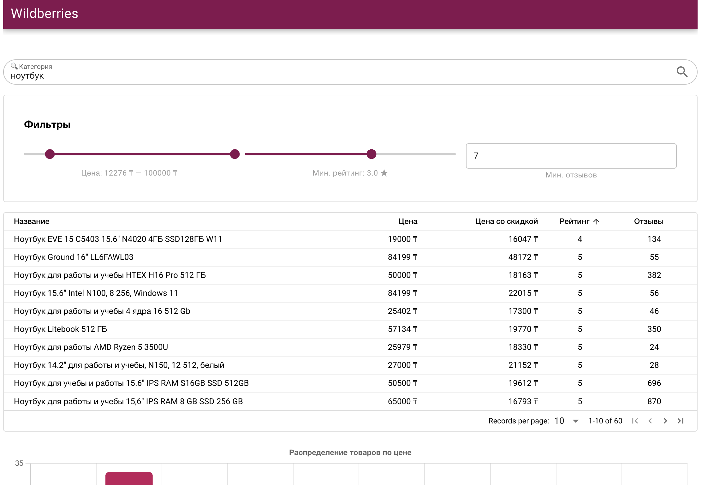
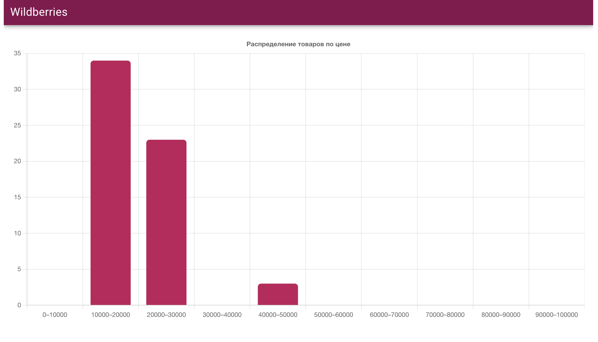
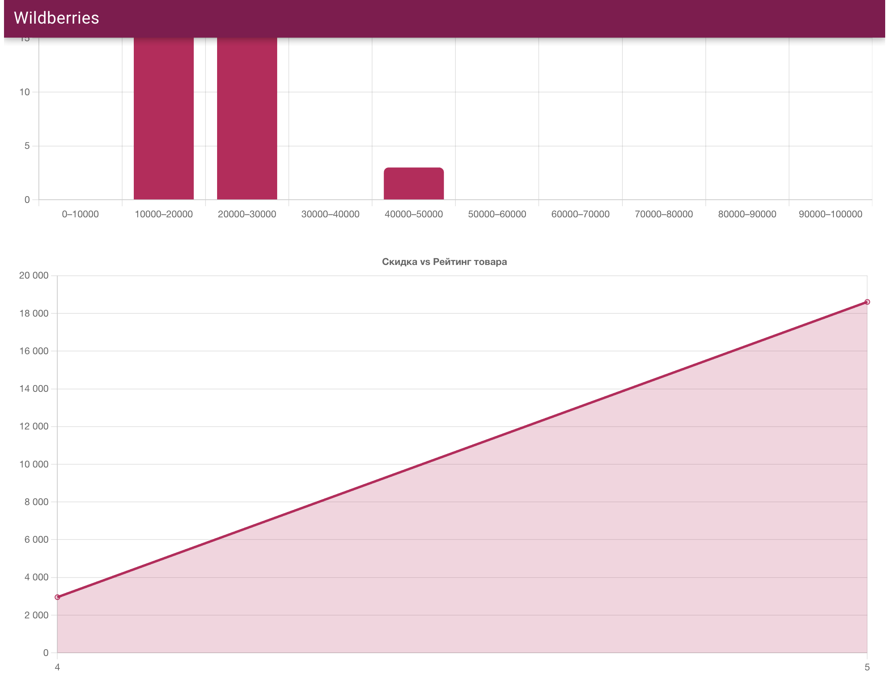

# 📦 WB Parser – Сервис парсинга и аналитики товаров Wildberries

Моно-репозиторий с API на Django и SPA-интерфейсом на Vue (Quasar), позволяющий искать товары Wildberries, сохранять их в базу и визуализировать данные по цене, рейтингу и скидкам.

---

## 🚀 Запуск проекта

### 🐍 Backend (Django)

Бэкенд запускается в контейнере через Docker и использует `.env` файл с переменными окружения.

1. Перейдите в директорию `backend/` и создайте `.env` файл:

    ```env
    DJANGO_SECRET_KEY=your-secret-key
    DEBUG=True
    ```

2. В той же директории выполните:

    ```bash
    docker compose -f docker-compose.dev.yml
    ```

3. Примените миграции внутри контейнера:

    ```bash
    docker compose -f docker-compose.dev.yml exec app uv run python manage.py migrate
    ```

4. Бэкенд будет доступен по адресу:

    ```
    http://localhost:8004/
    ```

---

### 💻 Frontend (Vue + Quasar)

Фронтенд **не использует Docker** и запускается локально через Node.js.

1. Перейдите в директорию `frontend/`:

    ```bash
    cd frontend/
    ```

2. Установите зависимости:

    ```bash
    npm install
    ```

3. Запустите приложение:

    ```bash
    quasar dev
    ```

4. После запуска интерфейс будет доступен по адресу:

    ```
    http://localhost:9000/
    ```

---

## 📊 Функциональность

- 🔍 Поиск товаров по названию через Wildberries
- 📥 Сохранение данных о товарах (цена, скидка, рейтинг, отзывы)
- 📊 Два графика:
  - **Гистограмма**: Распределение количества товаров по ценовым диапазонам
  - **Линейный график**: Зависимость скидки от рейтинга
- 🧩 Фильтрация и сортировка товаров по цене, рейтингу, количеству отзывов
- ⚠️ Обработка ошибок при запросах к API и валидации данных

---

## 🧪 Технологии

- **Backend**: Django, Django REST Framework, PostgreSQL, Pydantic, Loguru
- **Frontend**: Vue 3, Quasar Framework, Chart.js, Axios
- **DevTools**: Docker, uv, Ruff, ESLint, Prettier

---

---

## 📌 Примечания

- Парсинг запускается по GET-запросу:

    ```
    /api/core/products/parse/?category=название
    ```

---

## 🖼️ Скриншоты интерфейса



---



---



## 📝 Turarov Miras
